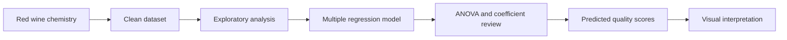

# Wine Quality Prediction

> A data-story project that turns red wine chemistry into a quality score forecast.

## The Idea

Every bottle leaves a chemical fingerprint: acidity, sulphates, chlorides, density, alcohol, pH, sugar, and sulfur dioxide levels all whisper something about how tasters may score it. This project explores those signals with applied regression and builds a prediction workflow for red wine quality.

The goal is simple:

**Use measurable wine properties to estimate perceived quality.**

## Dataset Snapshot

The project uses the classic red wine quality dataset with:

| Detail | Value |
| --- | --- |
| Observations | 1,599 wines |
| Predictors | 11 physicochemical variables |
| Target | `quality` score |
| Modeling lens | Multiple linear regression |

Key predictors include:

- Fixed acidity
- Volatile acidity
- Citric acid
- Residual sugar
- Chlorides
- Free sulfur dioxide
- Total sulfur dioxide
- Density
- pH
- Sulphates
- Alcohol

## Modeling Flow



## What This Project Looks For

This analysis asks a few practical questions:

- Which wine chemistry measurements have the strongest relationship with quality?
- Do alcohol, sulphates, and acidity meaningfully explain score differences?
- How well can a linear model approximate human quality ratings?
- Which variables deserve the most attention in future wine-quality experiments?

## Core Regression Concept

The main model estimates quality as a function of all available predictors:

```r
quality ~ fixed.acidity +
          volatile.acidity +
          citric.acid +
          residual.sugar +
          chlorides +
          free.sulfur.dioxide +
          total.sulfur.dioxide +
          density +
          pH +
          sulphates +
          alcohol
```

The project then reviews coefficient significance, t-values, ANOVA variation, and predicted quality values to understand which ingredients of the wine profile matter most.

## Visual Story

Planned visual outputs include:

- Coefficient t-value bar charts
- ANOVA sum-of-squares comparison
- Pairwise predictor exploration
- Predicted quality versus each chemical variable
- Regression trend overlays for interpretation

## Why It Matters

Wine quality is subjective, but chemistry gives it structure. A model like this cannot replace expert tasting, but it can reveal patterns that are hard to see by looking at raw rows of data. It is a compact example of how applied regression can translate real-world measurements into useful prediction and explanation.

## Tech Stack

| Tool | Purpose |
| --- | --- |
| R | Data analysis and modeling |
| Linear regression | Quality prediction |
| ANOVA | Predictor contribution review |
| ggplot2 | Visualization |
| gridExtra | Multi-plot layout |

## Future Upgrades

- Add train/test validation
- Compare linear regression with random forest or gradient boosting
- Add residual diagnostics
- Build a small prediction app
- Create a polished report with model findings

## Project Mood

```text
grapes -> chemistry -> regression -> insight -> better prediction
```

Raise a glass to interpretable modeling.
